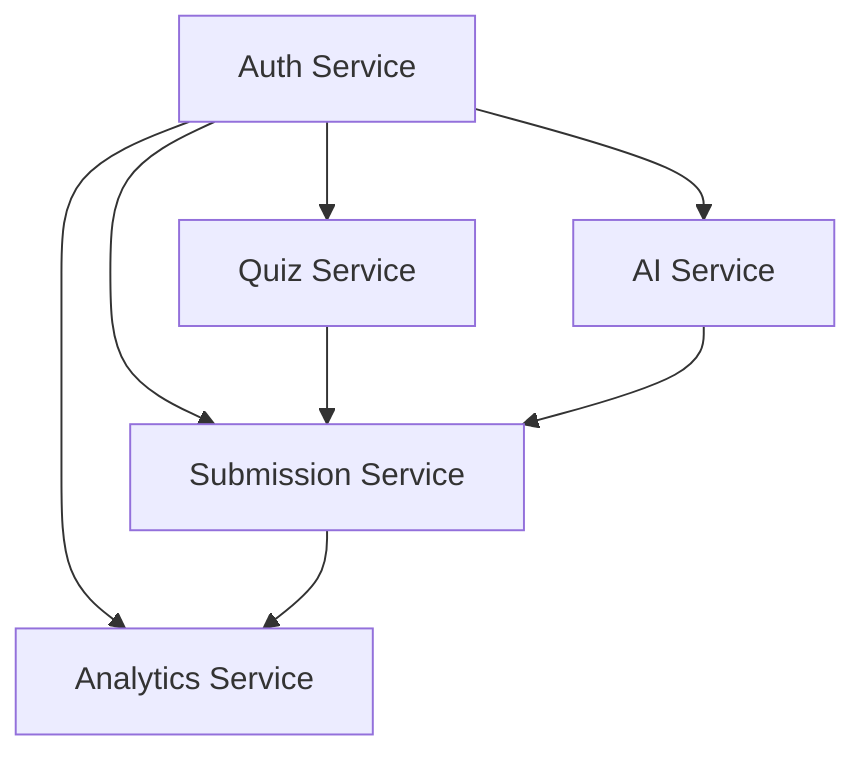

# AI Quizzer - Live on Azure! 🚀

A scalable microservices-based quiz platform with AI-powered question generation, intelligent scoring, adaptive
difficulty, quiz retry functionality, and comprehensive analytics with leaderboards.

**🌐 LIVE DEPLOYMENT:** All services are now running on Azure Container Instances!

- if there is any change in Deployment, please refer this docs on https://jaiminpatel345.github.io/docs (Yes I don't put code on GitHub, this is only docs)
- If want to see postman docs, open docs/postman_guide.md file
- Also checkout docs/index.md 

# 🌐 Live Service URLs

| Service                   | Live URL                                                           | localhost Port | Health Check                                                                             |
|---------------------------|--------------------------------------------------------------------|--------------  |------------------------------------------------------------------------------------------|
| 🔐 **Auth Service**       | http://quizzer-auth-1756088522.southindia.azurecontainer.io       | 3001           | [Health](http://quizzer-auth-1756068070.southindia.azurecontainer.io:3001/health)       |
| 🤖 **AI Service**         | http://quizzer-ai-1756068070.southindia.azurecontainer.io         | 3003           | [Health](http://quizzer-ai-1756068070.southindia.azurecontainer.io:3002/health)         |
| 📝 **Quiz Service**       | http://quizzer-quiz-1756068070.southindia.azurecontainer.io       | 3002           | [Health](http://quizzer-quiz-1756068070.southindia.azurecontainer.io:3003/health)       |
| 📋 **Submission Service** | http://quizzer-submission-1756068070.southindia.azurecontainer.io | 3004           | [Health](http://quizzer-submission-1756068070.southindia.azurecontainer.io:3004/health) |
| 📊 **Analytics Service**  | http://quizzer-analytics-1756068070.southindia.azurecontainer.io  | 3005           | [Health](http://quizzer-analytics-1756068070.southindia.azurecontainer.io:3005/health)  |

## 📋 Table of Contents

1. [Architecture Overview](#architecture-overview)
2. [Services Overview](#services-overview)
3. [Key Features](#key-features)
4. [Quick Start Guide](#quick-start-guide)
5. [API Flows & Testing](#api-flows--testing)
6. [Service Documentation](#service-documentation)
7. [Technology Stack](#technology-stack)
8. [Development & Deployment](#development--deployment)

---

## 🏗️ Architecture Overview

```
┌─────────────────┐    ┌───────��────────┐    ┌───────────��──────┐
│   Auth Service  │    │   Quiz Service  │    │   AI Service      │
│                 │    │                 │    │                   │ 
│ • Authentication│    │ • Quiz CRUD     │    │ • Question Gen    │
│ • User Profile  │    │ • Content Mgmt  │    │ • AI Evaluation   │
│ • JWT Tokens    │    │ • Quiz History  │    │ • Hint Generation │
│                 │    │ • Adaptive Quiz │    │ • Difficulty Adj  │
└─────────────────┘    └─────────────────┘    └───────────────────┘

┌──────────────────┐    ┌─────────────────┐    
│Submission Svc    │    │Analytics Service│    
│                  │    │                 │    
│ • Quiz Scoring   │    │ • Performance   │    
│ • Smart Grading  │    │ • Leaderboards  │    
│ • Submission Mgmt│    │ • Trend Analysis│    
│ • Quiz Retry     │    │ • User Rankings │    
│ • Attempt History│    │ • Statistics    │    
└──────────────────┘    └─────────────────┘    
```

## 📊 Services Overview

| Service                | Live URL                                                                       | Database      | Purpose                                     | Status |
|------------------------|--------------------------------------------------------------------------------|---------------|---------------------------------------------|--------|
| **Auth Service**       | [Live](http://quizzer-auth-1756068070.southindia.azurecontainer.io:3001)       | MongoDB Atlas | User authentication & profile management    | ✅ Live |
| **Quiz Service**       | [Live](http://quizzer-quiz-1756068070.southindia.azurecontainer.io:3003)       | MongoDB Atlas | Quiz content management & CRUD operations   | ✅ Live |
| **AI Service**         | [Live](http://quizzer-ai-1756068070.southindia.azurecontainer.io:3002)         | MongoDB Atlas | AI-powered question generation & evaluation | ✅ Live |
| **Submission Service** | [Live](http://quizzer-submission-1756068070.southindia.azurecontainer.io:3004) | MongoDB Atlas | Quiz submission & scoring system            | ✅ Live |
| **Analytics Service**  | [Live](http://quizzer-analytics-1756068070.southindia.azurecontainer.io:3005)  | MongoDB Atlas | Performance analytics & leaderboards        | ✅ Live |

## 🧪 Quick Test Commands

Test all services with these commands:

```bash
# Test Auth Service
curl http://quizzer-auth-1756068070.southindia.azurecontainer.io:3001/health

# Test AI Service  
curl http://quizzer-ai-1756068070.southindia.azurecontainer.io:3002/health

# Test Quiz Service
curl http://quizzer-quiz-1756068070.southindia.azurecontainer.io:3003/health

# Test Submission Service
curl http://quizzer-submission-1756068070.southindia.azurecontainer.io:3004/health

# Test Analytics Service
curl http://quizzer-analytics-1756068070.southindia.azurecontainer.io:3005/health
```

## 🚀 Deployment Status

- **Platform:** Azure Container Instances
- **Registry:** Azure Container Registry (quizzerregistry1756067615.azurecr.io)
- **Database:** MongoDB Atlas (Online)
- **Cache:** Redis Cloud (Online)
- **Cost:** ~$5-10/month (Azure for Students)

---

## 🌟 Key Features

### 🤖 AI-Powered Intelligence

- **Smart Question Generation**: Using Groq and Gemini with adaptive difficulty
- **Real-time Difficulty Adjustment**: Questions adapt during quiz based on performance
- **Intelligent Evaluation**: AI-powered feedback and improvement suggestions
- **Context-Aware Hints**: Dynamic hint generation for learning support

### 📊 Advanced Analytics & Leaderboards

- **Performance Tracking**: Detailed statistics, trends, and progress monitoring
- **Multi-dimensional Leaderboards**: Overall, grade-specific, subject-specific rankings
- **User Context Integration**: Personal rankings with nearby users
- **Comprehensive Statistics**: Score analytics, participation rates, distributions

### 🎯 Smart Scoring & Retry System

- **Multi-Format Support**: MCQ, True/False, Short Answer questions
- **Fuzzy Matching**: Intelligent short answer evaluation
- **Quiz Retry Functionality**: Complete attempt tracking with progression analysis
- **Attempt Comparison**: Compare performance across multiple attempts

### 🔐 Enterprise-Grade Security

- **JWT Authentication**: Secure token-based authentication system
- **Rate Limiting**: Comprehensive protection against API abuse
- **Input Validation**: Robust data validation using Joi schemas
- **Error Handling**: Consistent error responses across all services

---

## 🚀 Quick Start Guide

### Prerequisites

```bash
# Required Software
Node.js 20+
MongoDB 6.0+
Redis 7.0+

# Required API Keys
GROQ_API_KEY=your-groq-api-key
GEMINI_API_KEY=your-gemini-api-key
```

### Installation

```bash
# 1. Unzip repository ; which you already did :)
cd quizzer

# 2. Make scripts executable
chmod +x infrastructure/scripts/*.sh

# 3. Install dependencies for all services
yarn install # can use npm also

# 4. Set up environment variables
cp .env.example .env
# Edit .env with your configuration

#5 start mongodb and redis server

# 6. Start all services
yarn dev
```

### Service Health Check

```bash
# Verify all services are running
curl http://localhost:3001/health  # Auth Service
curl http://localhost:3002/health  # Quiz Service
curl http://localhost:3003/health  # AI Service
curl http://localhost:3004/health  # Submission Service
curl http://localhost:3005/health  # Analytics Service
```

---

## � API Flows & Testing

### Authentication Flow

All protected endpoints require Bearer token authentication. Start by registering and logging in:

**Step 1**: Register user → `POST http://localhost:3001/api/auth/register`  
**Step 2**: Login → `POST http://localhost:3001/api/auth/login`  
**Step 3**: Use returned JWT token in Authorization header for all subsequent requests

### Flow 1: Basic Quiz Creation & Submission

**Purpose**: Create a quiz manually and submit answers

1. **Auth**: Login via Auth Service → Get Bearer token
2. **Create Quiz**: `POST http://localhost:3002/api/quiz` with quiz data
3. **Get Quiz**: `GET http://localhost:3002/api/quiz/:quizId` to start taking quiz
4. **Submit Quiz**: `POST http://localhost:3004/api/submission/submit` with answers
5. **View Results**: `GET http://localhost:3004/api/submission/:submissionId`

### Flow 2: AI-Powered Quiz Generation

**Purpose**: Generate quiz using AI and take it

1. **Auth**: Login via Auth Service → Get Bearer token
2. **Generate Questions**: `POST http://localhost:3003/api/ai/generate/questions` with requirements
3. **Create AI Quiz**: `POST http://localhost:3002/api/quiz/generate` with AI parameters
4. **Take Quiz**: Submit answers using Submission Service
5. **AI Evaluation**: Enable `requestEvaluation: true` for AI feedback

### Flow 3: Hint Generation During Quiz

**Purpose**: Get AI-powered hints while taking a quiz

1. **Auth**: Login via Auth Service → Get Bearer token
2. **Start Quiz**: Get quiz data from Quiz Service
3. **Request Hint**: `POST http://localhost:3002/api/quiz/:quizId/question/:questionId/hint`
4. **Progressive Hints**: Request higher hint levels (1, 2, 3) as needed
5. **Submit with Hint Tracking**: Include `hintsUsed` count in submission

### Flow 4: Adaptive Learning Experience

**Purpose**: Create personalized adaptive quizzes

1. **Auth**: Login via Auth Service → Get Bearer token
2. **Get User Performance**: Retrieve from Analytics Service for adaptation
3. **Create Adaptive Quiz**: `POST http://localhost:3002/api/quiz/adaptive` with performance data
4. **Real-time Adjustment**: `POST http://localhost:3002/api/quiz/adjust-difficulty` during quiz
5. **Analyze Results**: Get personalized suggestions from Quiz Service

### Flow 5: Quiz Retry & Attempt Management

**Purpose**: Retry quizzes and compare performance across attempts

1. **Auth**: Login via Auth Service → Get Bearer token
2. **View Previous Attempts**: `GET http://localhost:3004/api/submission/quiz/:quizId/attempts`
3. **Retry Quiz**: `POST http://localhost:3004/api/submission/quiz/:quizId/retry` with new answers
4. **Compare Attempts**: `GET http://localhost:3004/api/submission/quiz/:quizId/compare`
5. **Get Best Attempt**: `GET http://localhost:3004/api/submission/quiz/:quizId/best`

### Flow 6: Leaderboards & Analytics

**Purpose**: View rankings and analyze performance

1. **View Public Leaderboard**: `GET http://localhost:3005/api/leaderboard` (no auth needed)
2. **Auth for Personal Data**: Login to access user-specific features
3. **Check Personal Rank**: `GET http://localhost:3005/api/leaderboard/my-rank`
4. **Get Performance Analytics**: `GET http://localhost:3005/api/analytics/performance`
5. **View Progress Trends**: `GET http://localhost:3005/api/analytics/trends`

### Flow 7: Real-time Difficulty Adjustment

**Purpose**: Dynamically adjust quiz difficulty during session

1. **Auth**: Login via Auth Service → Get Bearer token
2. **Start Adaptive Quiz**: Create quiz with adaptive parameters
3. **Monitor Progress**: Track user performance during quiz
4. **Adjust Difficulty**: `POST http://localhost:3003/api/ai/generate/adjust-difficulty`
5. **Continue Quiz**: Use adjusted questions for remaining quiz items

**Postman Testing Tips**:

- **Base URLs**: Auth(3001), Quiz(3002), AI(3003), Submission(3004), Analytics(3005)
- **Headers**: Always include `Authorization: Bearer <token>` and `Content-Type: application/json`
- **Rate Limits**: AI Service has strict limits (10-30 req/5min), others are more generous
- **Error Handling**: All services return consistent error format with HTTP status codes

---

## 📚 Service Documentation

### 1. Auth Service (Port 3001)

**Base URL**: `http://localhost:3001`
**Database**: `quiz_auth_db`
**Purpose**: User authentication, registration, and profile management

#### Key Endpoints

| Method | Endpoint             | Purpose                     | Auth Required |
|--------|----------------------|-----------------------------|---------------|
| `POST` | `/api/auth/login`    | User login with credentials | No            |
| `POST` | `/api/auth/register` | New user registration       | No            |
| `POST` | `/api/auth/validate` | JWT token validation        | Yes           |
| `GET`  | `/api/auth/profile`  | Get user profile            | Yes           |
| `PUT`  | `/api/auth/profile`  | Update user profile         | Yes           |

**📁 For detailed payloads:** See `services/auth-service/README.md`

---

### 2. Quiz Service (Port 3002)

**Base URL**: `http://localhost:3002`
**Database**: `quiz_content_db`
**Purpose**: Quiz creation, management, and content operations

#### Key Endpoints

| Method   | Endpoint                                      | Purpose                     |
|----------|-----------------------------------------------|-----------------------------|
| `GET`    | `/api/quiz`                                   | Get quizzes with filtering  |
| `GET`    | `/api/quiz/:quizId`                           | Get specific quiz           |
| `POST`   | `/api/quiz`                                   | Create new quiz             |
| `POST`   | `/api/quiz/generate`                          | Generate AI quiz            |
| `POST`   | `/api/quiz/adaptive`                          | Create adaptive quiz        |
| `PUT`    | `/api/quiz/:quizId`                           | Update quiz metadata        |
| `DELETE` | `/api/quiz/:quizId`                           | Soft delete quiz            |
| `POST`   | `/api/quiz/:quizId/duplicate`                 | Duplicate existing quiz     |
| `POST`   | `/api/quiz/:quizId/submit`                    | Submit quiz (proxy)         |
| `GET`    | `/api/quiz/history`                           | Get quiz history            |
| `POST`   | `/api/quiz/:quizId/question/:questionId/hint` | Generate hint               |

**📁 For detailed payloads:** See `services/quiz-service/README.md`

---

### 3. AI Service (Port 3003)

**Base URL**: `http://localhost:3003`
**Database**: `quiz_ai_db`
**Purpose**: AI-powered question generation, evaluation, and adaptive learning

#### Key Endpoints

| Method | Endpoint                             | Purpose                         | Auth Required |
|--------|--------------------------------------|---------------------------------|---------------|
| `POST` | `/api/ai/generate/questions`         | Generate standard questions     | Yes           |
| `POST` | `/api/ai/generate/adaptive`          | Generate adaptive questions     | Yes           |
| `POST` | `/api/ai/generate/adjust-difficulty` | Real-time difficulty adjustment | Yes           |
| `POST` | `/api/ai/generate/hint`              | Generate hints for questions    | Yes           |
| `POST` | `/api/ai/evaluate/submission`        | AI evaluation of submissions    | Yes           |
| `POST` | `/api/ai/evaluate/suggestions`       | Get improvement suggestions     | Yes           |

**📁 For detailed payloads:** See `services/ai-service/README.md`

---

### 4. Submission Service (Port 3004)

**Base URL**: `http://localhost:3004`
**Database**: `quiz_submissions_db`
**Purpose**: Quiz submission handling, scoring, and attempt management

#### Key Endpoints

| Method | Endpoint                                | Purpose                   | Auth Required |
|--------|-----------------------------------------|---------------------------|---------------|
| `POST` | `/api/submission/submit`                | Submit quiz answers       | Yes           |
| `GET`  | `/api/submission`                       | Get user submissions      | Yes           |
| `GET`  | `/api/submission/:submissionId`         | Get specific submission   | Yes           |
| `GET`  | `/api/submission/:submissionId/details` | Get detailed submission   | Yes           |
| `GET`  | `/api/submission/quiz/:quizId/attempts` | Get all quiz attempts     | Yes           |
| `POST` | `/api/submission/quiz/:quizId/retry`    | Retry quiz (new attempt)  | Yes           |
| `GET`  | `/api/submission/quiz/:quizId/best`     | Get best attempt for quiz | Yes           |
| `GET`  | `/api/submission/quiz/:quizId/compare`  | Compare two quiz attempts | Yes           |

**📁 For detailed payloads:** See `services/submission-service/README.md`

---

### 5. Analytics Service (Port 3005)

**Base URL**: `http://localhost:3005`
**Database**: `quiz_analytics_db`
**Purpose**: Performance analytics, leaderboards, and user insights

#### Key Endpoints

| Method | Endpoint                                     | Purpose                          | Auth Required |
|--------|----------------------------------------------|----------------------------------|---------------|
| `GET`  | `/api/analytics/performance`                 | Get overall user performance     | Yes           |
| `GET`  | `/api/analytics/performance/:subject/:grade` | Get subject-specific performance | Yes           |
| `GET`  | `/api/analytics/trends`                      | Get performance trends           | Yes           |
| `GET`  | `/api/analytics/topics`                      | Get topic-wise analysis          | Yes           |
| `POST` | `/api/analytics/performance/update`          | Update performance (internal)    | Yes           |
| `GET`  | `/api/leaderboard`                           | Get leaderboard rankings         | Optional      |
| `GET`  | `/api/leaderboard/top`                       | Get top performers               | No            |
| `GET`  | `/api/leaderboard/my-rank`                   | Get user's rank                  | Yes           |

**📁 For detailed payloads:** See `services/analytics-service/README.md`

---

## 🛠️ Technology Stack

### Core Technologies

- **Runtime**: Node.js 20+ with TypeScript
- **Framework**: Express.js with middleware ecosystem
- **Database**: MongoDB 6.0+ with Mongoose ODM
- **Caching**: Redis 7.0+ for session and data caching
- **Authentication**: JWT with bcrypt password hashing

### AI Integration

- **Primary AI**: Groq API (llama-3.1-70b-versatile)
- **Fallback AI**: Google Gemini Pro
- **Strategy**: Automatic failover for reliability

### Development Tools

- **Validation**: Joi schema validation
- **Logging**: Winston with structured logging
- **Rate Limiting**: Express-rate-limit
- **CORS**: Configurable cross-origin resource sharing
- **Testing**: Jest (planned implementation)

### DevOps & Deployment

- **Containerization**: Docker & Docker Compose
- **Process Management**: PM2 for production
- **Environment**: dotenv configuration
- **Monitoring**: Health check endpoints

---

## 🔧 Development & Deployment

### Development Commands

```bash
# Start individual service
cd services/auth-service && yarn dev

# Start all services concurrently
yarn dev

# Build specific service
cd services/quiz-service && yarn build

# Build all services
yarn build
```

### Production Deployment

#### Using Docker

```bash
# Build all services
docker-compose build

# Start in production mode
docker-compose -f docker-compose.prod.yml up -d

# View logs
docker-compose logs -f
```


### Environment Variables

Each service requires specific environment configuration:

#### Common Variables

```env
NODE_ENV=production
LOG_LEVEL=info
MONGODB_URI=mongodb://localhost:27017/
REDIS_URL=redis://localhost:6379
```

#### Service-Specific Variables

```env
# Auth Service
JWT_SECRET=your-super-secret-jwt-key
JWT_EXPIRES_IN=7d
BCRYPT_ROUNDS=12

# AI Service
GROQ_API_KEY=your-groq-api-key
GEMINI_API_KEY=your-gemini-api-key

# Service URLs
AUTH_SERVICE_URL=http://localhost:3001
QUIZ_SERVICE_URL=http://localhost:3002
AI_SERVICE_URL=http://localhost:3003
SUBMISSION_SERVICE_URL=http://localhost:3004
ANALYTICS_SERVICE_URL=http://localhost:3005
```

### Service Dependencies



### Health Monitoring

Each service exposes health check endpoints at `/health` for monitoring and load balancer integration.

---

## Social
- See my Portfolio: https://portfolio.jaimin-detroja.tech you must like this :)
---

### Thank you 
