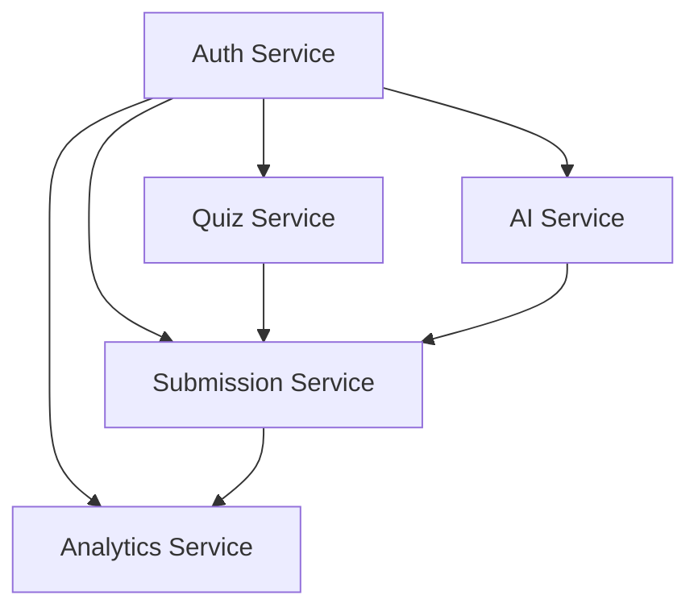

# AI Quizzer

A scalable microservices-based quiz platform with AI-powered question generation, intelligent scoring, and comprehensive
analytics.

## 📋 Table of Contents

1. [Architecture Overview](#architecture-overview)
2. [Services Overview](#services-overview)
3. [Key Features](#key-features)
4. [Quick Start Guide](#quick-start-guide)
5. [Service Documentation](#service-documentation)
6. [Technology Stack](#technology-stack)
7. [Development & Deployment](#development--deployment)

---

## 🏗️ Architecture Overview

```
┌─────────────────┐    ┌─────────────────┐    ┌───────────────────┐
│   Auth Service  │    │   Quiz Service  │    │   AI Service      │
│     Port 3001   │    │     Port 3002   │    │     Port 3003     │
│                 │    │                 │    │                   │ 
│ • Authentication│    │ • Quiz CRUD     │    │ • Question Gen    │
│ • User Profile  │    │ • Content Mgmt  │    │ • AI Evaluation   │
│ • JWT Tokens    │    │ • Quiz History  │    │ • Hint Generation │
└─────────────────┘    └─────────────────┘    └───────────────────┘

┌──────────────────┐    ┌─────────────────┐    ┌─────────────────────┐
│Submission Svc    │    │Analytics Service│    │Notification Svc     │
│   Port 3004      │    │    Port 3005    │    │    Port 3006        │
│                  │    │                 │    │                     │
│ • Quiz Scoring   │    │ • Performance   │    │ • Email Alerts      │
│ • Smart Grading  │    │ • Leaderboards  │    │ • Push Notifications│
│ • Submission Mgmt│    │ • Trend Analysis│    │ • Event System      │
└──────────────────┘    └─────────────────┘    └─────────────────────┘
```

## 📊 Services Overview

| Service                  | Port | Database                | Purpose                                     | Status     |
|--------------------------|------|-------------------------|---------------------------------------------|------------|
| **Auth Service**         | 3001 | `quiz_auth_db`          | User authentication & profile management    | ✅ Active   |
| **Quiz Service**         | 3002 | `quiz_content_db`       | Quiz content management & CRUD operations   | ✅ Active   |
| **AI Service**           | 3003 | `quiz_ai_db`            | AI-powered question generation & evaluation | ✅ Active   |
| **Submission Service**   | 3004 | `quiz_submissions_db`   | Quiz submission & intelligent scoring       | ✅ Active   |
| **Analytics Service**    | 3005 | `quiz_analytics_db`     | Performance analytics & leaderboards        | ✅ Active   |
| **Notification Service** | 3006 | `quiz_notifications_db` | Email & push notifications                  | 🚧 Planned |

---

## 🌟 Key Features

### 🤖 AI-Powered Intelligence

- **Smart Question Generation**: Using Groq (llama-3.1-70b-versatile) and Gemini 
- **Adaptive Difficulty**: Questions adapt to user performance history
- **Intelligent Evaluation**: AI-powered feedback and improvement suggestions
- **Context-Aware Hints**: Dynamic hint generation for learning support

### 📊 Advanced Analytics

- **Performance Tracking**: Detailed statistics, trends, and progress monitoring
- **Topic Analysis**: Automated strength/weakness identification
- **Multiple Leaderboards**: Overall, subject-specific, and time-based rankings
- **Learning Insights**: Personalized improvement recommendations

### 🎯 Smart Scoring System

- **Multi-Format Support**: MCQ, True/False, Short Answer questions
- **Fuzzy Matching**: Intelligent short answer evaluation (70% accuracy threshold)
- **Hint Penalties**: Balanced scoring with 10% reduction per hint (max 50%)
- **Attempt Tracking**: Complete quiz retry history with progression

### 🔐 Enterprise-Grade Security

- **JWT Authentication**: Secure token-based authentication system
- **Rate Limiting**: Comprehensive protection against API abuse
- **Input Validation**: Robust data validation using Joi schemas
- **Error Handling**: Consistent error responses across all services

---

## 🚀 Quick Start Guide

### Prerequisites

```bash
# Required Software
Node.js 20+
MongoDB 6.0+
Redis 7.0+

# Required API Keys
GROQ_API_KEY=your-groq-api-key
GEMINI_API_KEY=your-gemini-api-key
```

### Installation

```bash
# 1. Download/UnZip repository which you already done :)
cd quizzer

# 2. Install dependencies for all services
yarn install --workspaces

# 3. Set up environment variables
cp .env.example .env
# Edit .env with your configuration

# 4. Start infrastructure
docker-compose up -d mongodb redis

# 5. Start all services
yarn dev:all
```

### Service Health Check

```bash
# Verify all services are running
curl http://localhost:3001/health  # Auth Service
curl http://localhost:3002/health  # Quiz Service
curl http://localhost:3003/health  # AI Service
curl http://localhost:3004/health  # Submission Service
curl http://localhost:3005/health  # Analytics Service
```

---

## 📚 Service Documentation

### 1. Auth Service (Port 3001)

**Base URL**: `http://localhost:3001`
**Database**: `quiz_auth_db`
**Purpose**: User authentication, registration, and profile management

#### Key Endpoints

| Method | Endpoint             | Purpose                     | Auth Required |
|--------|----------------------|-----------------------------|---------------|
| `POST` | `/api/auth/login`    | User login with credentials | No            |
| `POST` | `/api/auth/register` | New user registration       | No            |
| `POST` | `/api/auth/validate` | JWT token validation        | Yes           |
| `GET`  | `/api/user/profile`  | Get user profile            | Yes           |
| `PUT`  | `/api/user/profile`  | Update user profile         | Yes           |

```bash
# For more info like payload & rate limiting visit 
cd services/auth-service
# and open README.md file
```

---

### 2. Quiz Service (Port 3002)

**Base URL**: `http://localhost:3002`
**Database**: `quiz_content_db`
**Purpose**: Quiz creation, management, and content operations

#### Key Endpoints

| Method   | Endpoint                       | Purpose                    | Auth Required |
|----------|--------------------------------|----------------------------|---------------|
| `GET`    | `/api/quiz`                    | Get quizzes with filtering | Optional      |
| `GET`    | `/api/quiz/{quizId}`           | Get specific quiz          | Optional*     |
| `POST`   | `/api/quiz`                    | Create new quiz            | Yes           |
| `PUT`    | `/api/quiz/{quizId}`           | Update quiz metadata       | Yes           |
| `DELETE` | `/api/quiz/{quizId}`           | Soft delete quiz           | Yes           |
| `POST`   | `/api/quiz/{quizId}/duplicate` | Duplicate existing quiz    | Yes           |

*Required for private quizzes

#### Sample Quiz Creation

```json
{
  "title": "Grade 8 Algebra Basics",
  "description": "Introduction to algebraic expressions and equations",
  "metadata": {
    "grade": 8,
    "subject": "Mathematics",
    "totalQuestions": 15,
    "timeLimit": 45,
    "difficulty": "medium",
    "tags": [
      "algebra",
      "equations",
      "basics"
    ],
    "category": "Mathematics"
  },
  "questions": [
    {
      "questionId": "q1",
      "questionText": "Solve for x: 2x + 5 = 15",
      "questionType": "short_answer",
      "correctAnswer": "5",
      "explanation": "Subtract 5 from both sides: 2x = 10, then divide by 2: x = 5",
      "difficulty": "medium",
      "points": 2,
      "hints": [
        "Isolate the variable",
        "Use inverse operations"
      ],
      "topic": "Linear Equations"
    }
  ],
  "isPublic": false
}
```

#### Query Parameters for Filtering

- `grade`: 1-12 (filter by grade level)
- `subject`: Subject name
- `difficulty`: easy|medium|hard|mixed
- `category`: Category filter
- `tags`: Comma-separated tag list
- `isPublic`: true|false
- `page`: Page number (default: 1)
- `limit`: Results per page (max: 100)

---

### 3. AI Service (Port 3003)

**Base URL**: `http://localhost:3003`
**Database**: `quiz_ai_db`
**Purpose**: AI-powered question generation, hints, and evaluation

#### AI Models Configuration

- **Primary**: Groq (llama-3.1-70b-versatile)
- **Fallback**: Google Gemini Pro
- **Strategy**: Groq first, automatic fallback to Gemini

#### Key Endpoints

| Method | Endpoint                       | Purpose                     | Rate Limit   |
|--------|--------------------------------|-----------------------------|--------------|
| `POST` | `/api/ai/generate/questions`   | Generate quiz questions     | 10 per 5 min |
| `POST` | `/api/ai/generate/adaptive`    | Generate adaptive questions | 10 per 5 min |
| `POST` | `/api/ai/generate/hint`        | Generate question hints     | 10 per 5 min |
| `POST` | `/api/ai/evaluate/submission`  | Evaluate quiz submission    | 10 per 5 min |
| `POST` | `/api/ai/evaluate/suggestions` | Get improvement suggestions | 10 per 5 min |

#### Sample AI Question Generation

```json
{
  "grade": 7,
  "subject": "Science",
  "difficulty": "medium",
  "totalQuestions": 10,
  "topics": [
    "photosynthesis",
    "cellular respiration"
  ],
  "adaptiveParams": {
    "userPastPerformance": {
      "averageScore": 78,
      "totalQuizzes": 12
    },
    "difficultyDistribution": {
      "easy": 20,
      "medium": 60,
      "hard": 20
    }
  }
}
```

---

### 4. Submission Service (Port 3004)

**Base URL**: `http://localhost:3004`
**Database**: `quiz_submissions_db`
**Purpose**: Quiz submission processing, scoring, and history management

#### Scoring Algorithm

- **Multiple Choice**: Exact match scoring
- **True/False**: Boolean comparison
- **Short Answer**: Fuzzy matching (70% accuracy threshold)
- **Hint Penalty**: 10% reduction per hint used (maximum 50% penalty)

#### Key Endpoints

| Method | Endpoint                                 | Purpose                     | Rate Limit     |
|--------|------------------------------------------|-----------------------------|----------------|
| `POST` | `/api/submission/submit`                 | Submit quiz for scoring     | 20 per 10 min  |
| `GET`  | `/api/submission`                        | Get user submission history | 100 per 15 min |
| `GET`  | `/api/submission/{submissionId}`         | Get specific submission     | 100 per 15 min |
| `GET`  | `/api/submission/{submissionId}/details` | Get detailed submission     | 100 per 15 min |

#### Sample Quiz Submission

```json
{
  "quizId": "60d5ecb54e24c30015d4f8a1",
  "answers": [
    {
      "questionId": "q1",
      "userAnswer": "5",
      "timeSpent": 45,
      "hintsUsed": 0
    },
    {
      "questionId": "q2",
      "userAnswer": "photosynthesis",
      "timeSpent": 60,
      "hintsUsed": 1
    }
  ],
  "startedAt": "2024-01-15T10:00:00.000Z",
  "submittedAt": "2024-01-15T10:15:30.000Z",
  "requestEvaluation": true
}
```

---

### 5. Analytics Service (Port 3005)

**Base URL**: `http://localhost:3005`
**Database**: `quiz_analytics_db`
**Purpose**: Performance tracking, analytics, and leaderboard management

#### Analytics Features

- **Performance Metrics**: Comprehensive statistical analysis
- **Trend Detection**: Automatic improvement/decline identification
- **Topic Mastery**: Subject and topic-wise accuracy tracking
- **Leaderboard Management**: Multiple ranking systems with caching

#### Key Endpoints

| Method | Endpoint                                       | Purpose                      | Auth Required |
|--------|------------------------------------------------|------------------------------|---------------|
| `GET`  | `/api/analytics/performance`                   | User performance overview    | Yes           |
| `GET`  | `/api/analytics/performance/{subject}/{grade}` | Subject-specific performance | Yes           |
| `GET`  | `/api/analytics/trends`                        | Performance trends analysis  | Yes           |
| `GET`  | `/api/analytics/topics`                        | Topic-wise breakdown         | Yes           |
| `GET`  | `/api/leaderboard`                             | Get leaderboard rankings     | Optional      |
| `GET`  | `/api/leaderboard/my-rank`                     | Get user's current rank      | Yes           |

#### Leaderboard Types

```bash
# Overall leaderboard
GET /api/leaderboard?type=overall&limit=50

# Subject-specific leaderboard
GET /api/leaderboard?type=grade_subject&grade=8&subject=Math&limit=50

# Monthly leaderboard
GET /api/leaderboard?type=monthly&month=12&year=2024&limit=50
```

---

## 🛠️ Technology Stack

### Core Technologies

- **Runtime**: Node.js 20+ with TypeScript
- **Framework**: Express.js with middleware ecosystem
- **Database**: MongoDB 6.0+ with Mongoose ODM
- **Caching**: Redis 7.0+ for session and data caching
- **Authentication**: JWT with bcrypt password hashing

### AI Integration

- **Primary AI**: Groq API (llama-3.1-70b-versatile)
- **Fallback AI**: Google Gemini Pro
- **Strategy**: Automatic failover for reliability

### Development Tools

- **Validation**: Joi schema validation
- **Logging**: Winston with structured logging
- **Rate Limiting**: Express-rate-limit
- **CORS**: Configurable cross-origin resource sharing
- **Testing**: Jest (planned implementation)

### DevOps & Deployment

- **Containerization**: Docker & Docker Compose
- **Process Management**: PM2 for production
- **Environment**: dotenv configuration
- **Monitoring**: Health check endpoints

---

## 🔧 Development & Deployment

### Development Commands

```bash
# Start individual service
cd services/auth-service && yarn dev

# Start all services concurrently
yarn dev:all

# Build specific service
cd services/quiz-service && yarn build

# Build all services
yarn build:all
```

### Production Deployment

#### Using Docker

```bash
# Build all services
docker-compose build

# Start in production mode
docker-compose -f docker-compose.prod.yml up -d

# View logs
docker-compose logs -f
```

#### Manual Deployment

```bash
# Build all services
yarn build:all

# Start with PM2
pm2 start ecosystem.config.js
```

### Environment Variables

Each service requires specific environment configuration:

#### Common Variables

```env
NODE_ENV=production
LOG_LEVEL=info
MONGODB_URI=mongodb://localhost:27017/
REDIS_URL=redis://localhost:6379
```

#### Service-Specific Variables

```env
# Auth Service
JWT_SECRET=your-super-secret-jwt-key
JWT_EXPIRES_IN=7d
BCRYPT_ROUNDS=12

# AI Service
GROQ_API_KEY=your-groq-api-key
GEMINI_API_KEY=your-gemini-api-key

# Service URLs
AUTH_SERVICE_URL=http://localhost:3001
QUIZ_SERVICE_URL=http://localhost:3002
AI_SERVICE_URL=http://localhost:3003
SUBMISSION_SERVICE_URL=http://localhost:3004
ANALYTICS_SERVICE_URL=http://localhost:3005
```

### Service Dependencies



### Health Monitoring

Each service exposes health check endpoints at `/health` for monitoring and load balancer integration.

---

## 📄 License

This project is licensed under the MIT License - see the [LICENSE](LICENSE) file for details.

## 🤝 Contributing

1. Fork the repository
2. Create feature branch: `git checkout -b feature/amazing-feature`
3. Commit changes: `git commit -m 'Add amazing feature'`
4. Push to branch: `git push origin feature/amazing-feature`
5. Open Pull Request

---

## 📞 Support

For questions, issues, or contributions, please refer to the individual service documentation or create an issue in the
project repository.