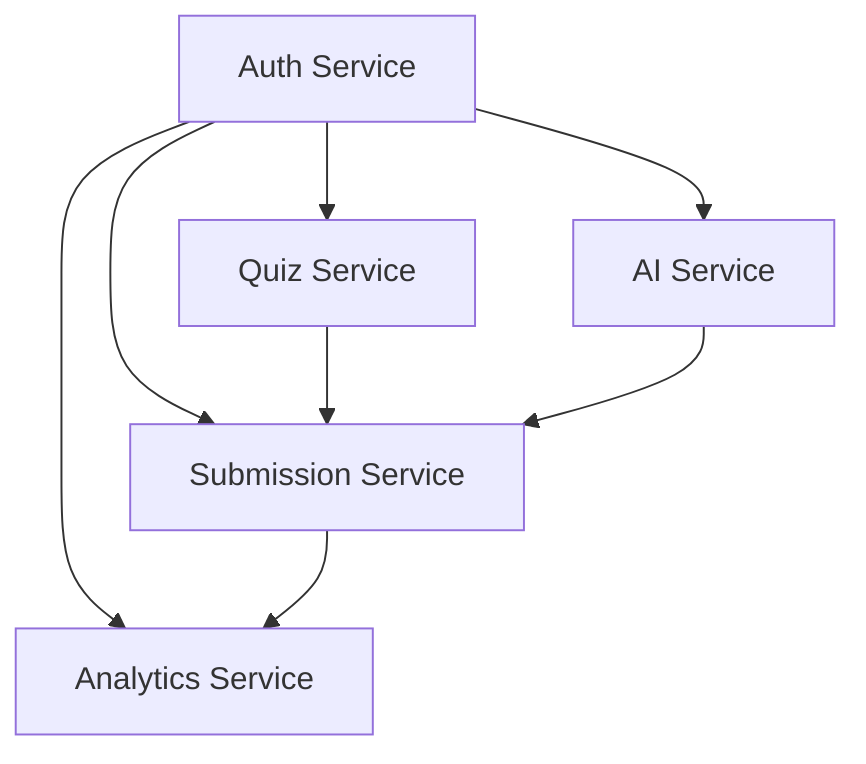

# Quizzer - AI powerd quiz app backend ( Microservice ) 

A scalable microservices-based quiz platform with AI-powered question generation, intelligent scoring, adaptive difficulty, quiz retry functionality, and comprehensive analytics with leaderboards.

## 📋 Table of Contents

1. [🏗️ Architecture Overview](#️-architecture-overview)
2. [🌟 Key Features](#-key-features)
3. [🚀 Quick Start Guide](#-quick-start-guide)
4. [📡 API Flows & Testing](#-api-flows--testing)
5. [📚 Service Documentation](#-service-documentation)
6. [🛠️ Technology Stack](#️-technology-stack)
7. [🔧 Development & Deployment](#-development--deployment)

---

## 🏗️ Architecture Overview

### 🎯 System Architecture Diagram


```mermaid
graph TB
    %% External APIs
    subgraph "External AI APIs"
        GROQ[🤖 Groq API<br/>llama-3.1-70b-versatile]
        GEMINI[🧠 Gemini API<br/>gemini-2.0-flash]
    end

    %% External Infrastructure
    subgraph "Infrastructure"
        MONGO[(🍃 MongoDB<br/>Database)]
        REDIS[(⚡ Redis<br/>Cache/Sessions)]
        DOCKER[🐳 Docker<br/>Containerization]
    end

    %% Client Layer
    subgraph "Client Layer"
        CLIENT[📱 Client App<br/>React/Mobile]
    end

    %% Microservices
    subgraph "Microservices Architecture"
        subgraph "Auth Service Port 3001"
            AUTH[Auth Controller]
            JWT[JWT Middleware]
            BCRYPT[Password Hashing]
            USERMODEL[User Model]
        end

        subgraph "Quiz Service Port 3002"
            QUIZ[Quiz Controller]
            QUIZMODEL[Quiz Model]
            ADAPTIVE[Adaptive Logic]
            HINTS[Hint System]
        end

        subgraph "AI Service Port 3003"
            AIGEN[Generation Controller]
            AIEVAL[Evaluation Controller]
            GROQSVC[Groq Service]
            GEMINISVC[Gemini Service]
            DIFFICULTY[Adaptive Difficulty]
        end

        subgraph "Submission Service Port 3004"
            SUBMIT[Submission Controller]
            SCORING[Smart Scoring]
            FUZZY[Fuzzy Matching]
            RETRY[Retry System]
            ATTEMPTS[Attempt Tracking]
        end

        subgraph "Analytics Service Port 3005"
            ANALYTICS[Analytics Controller]
            LEADERBOARD[Leaderboard Controller]
            PERFORMANCE[Performance Tracking]
            TRENDS[Trend Analysis]
        end
    end

    %% Data Flow Connections
    CLIENT -->|📤 HTTP Requests| AUTH
    CLIENT -->|📤 Authenticated Requests| QUIZ
    CLIENT -->|📤 Authenticated Requests| SUBMIT
    CLIENT -->|📥 Public Data| ANALYTICS

    %% Inter-service Communication
    AUTH -.->|🔑 Token Validation| QUIZ
    AUTH -.->|🔑 Token Validation| SUBMIT
    AUTH -.->|🔑 Token Validation| ANALYTICS

    QUIZ -->|🧠 Generate Questions| AIGEN
    QUIZ -->|💡 Request Hints| AIGEN
    QUIZ -->|⚙️ Adjust Difficulty| DIFFICULTY

    SUBMIT -->|🤖 Request AI Evaluation| AIEVAL
    SUBMIT -->|📊 Send Performance Data| ANALYTICS

    ANALYTICS -->|📈 Get User Stats| SUBMIT
    ANALYTICS -->|🏆 Update Leaderboards| SUBMIT

    %% External Connections
    GROQSVC -->|API Calls| GROQ
    GEMINISVC -->|API Calls| GEMINI

    %% Database Connections
    USERMODEL -->|Store/Retrieve| MONGO
    QUIZMODEL -->|Store/Retrieve| MONGO
    SUBMIT -->|Store/Retrieve| MONGO
    ANALYTICS -->|Store/Retrieve| MONGO

    %% Cache Connections
    JWT -.->|Session Management| REDIS
    PERFORMANCE -.->|Cache Results| REDIS

    %% Styling
    classDef serviceBox fill:#e1f5fe,stroke:#01579b,stroke-width:2px
    classDef aiBox fill:#f3e5f5,stroke:#4a148c,stroke-width:2px
    classDef dbBox fill:#e8f5e8,stroke:#1b5e20,stroke-width:2px
    classDef clientBox fill:#fff3e0,stroke:#e65100,stroke-width:2px

    class AUTH,QUIZ,AIGEN,SUBMIT,ANALYTICS serviceBox
    class GROQ,GEMINI,GROQSVC,GEMINISVC,AIEVAL aiBox
    class MONGO,REDIS dbBox
    class CLIENT clientBox
```

### 🔄 Service Communication Flow

```
┌─────────────────────────────────────────────────────────────────────────────────┐
│                           🔄 REQUEST FLOW DIAGRAM                              │
├─────────────────────────────────────────────────────────────────────────────────┤
│                                                                                 │
│  1. 🔐 AUTHENTICATION                                                           │
│     Client → Auth Service → JWT Token → All Services                           │
│                                                                                 │
│  2. 📝 QUIZ CREATION                                                            │
│     Client → Quiz Service → AI Service (Groq/Gemini) → Generated Questions     │
│                                                                                 │
│  3. 🎯 QUIZ TAKING                                                              │
│     Client → Quiz Service → Hint Requests → AI Service                         │
│                           → Difficulty Adjustment → AI Service                 │
│                                                                                 │
│  4. 📊 SUBMISSION                                                               │
│     Client → Submission Service → AI Evaluation → AI Service                   │
│                                 → Performance Data → Analytics Service         │
│                                                                                 │
│  5. 📈 ANALYTICS                                                                │
│     Analytics Service ← Performance Data ← Submission Service                  │
│     Client ← Leaderboards/Stats ← Analytics Service                            │
│                                                                                 │
└─────────────────────────────────────────────────────────────────────────────────┘
```

### 🛠️ Technology Stack per Service

| Service | Port | Database | Key Technologies | External APIs |
|---------|------|----------|------------------|---------------|
| **🔐 Auth** | 3001 | MongoDB | JWT, bcrypt, Express | - |
| **📝 Quiz** | 3002 | MongoDB | Express, Joi validation | Auth Service |
| **🤖 AI** | 3003 | MongoDB | Groq SDK, Google Gen AI | Groq, Gemini |
| **📊 Submission** | 3004 | MongoDB | Fuzzy matching, Express | AI Service |
| **📈 Analytics** | 3005 | MongoDB | Express, Redis cache | Submission Service |

### 🔒 Security & Middleware

```
┌─────────────────────────────────────────────────────────────────┐
│                    🛡️ SECURITY LAYERS                          │
├─────────────────────────────────────────────────────────────────┤
│                                                                 │
│  🔐 Authentication Layer                                        │
│  ├── JWT Token-based authentication                             │
│  ├── Password hashing with bcrypt                               │
│  └── Token validation across services                           │
│                                                                 │
│  🚦 Rate Limiting                                               │
│  ├── Request throttling per endpoint                            │
│  ├── IP-based rate limiting                                     │
│  └── User-based rate limiting                                   │
│                                                                 │
│  ✅ Input Validation                                            │
│  ├── Joi schema validation                                      │
│  ├── Request sanitization                                       │
│  └── Type-safe TypeScript interfaces                            │
│                                                                 │
│  🎯 Error Handling                                              │
│  ├── Centralized error management                               │
│  ├── Consistent error responses                                 │
│  └── Logging with Winston                                       │
│                                                                 │
└─────────────────────────────────────────────────────────────────┘
```


## 🌟 Key Features

### 🤖 AI-Powered Intelligence

- **Smart Question Generation**: Using Groq and Gemini with adaptive difficulty
- **Real-time Difficulty Adjustment**: Questions adapt during quiz based on performance
- **Intelligent Evaluation**: AI-powered feedback and improvement suggestions
- **Context-Aware Hints**: Dynamic hint generation for learning support

### 📊 Advanced Analytics & Leaderboards

- **Performance Tracking**: Detailed statistics, trends, and progress monitoring
- **Multi-dimensional Leaderboards**: Overall, grade-specific, subject-specific rankings
- **User Context Integration**: Personal rankings with nearby users
- **Comprehensive Statistics**: Score analytics, participation rates, distributions

### 🎯 Smart Scoring & Retry System

- **Multi-Format Support**: MCQ, True/False, Short Answer questions
- **Fuzzy Matching**: Intelligent short answer evaluation
- **Quiz Retry Functionality**: Complete attempt tracking with progression analysis
- **Attempt Comparison**: Compare performance across multiple attempts

### 🔐 Enterprise-Grade Security

- **JWT Authentication**: Secure token-based authentication system
- **Rate Limiting**: Comprehensive protection against API abuse
- **Input Validation**: Robust data validation using Joi schemas
- **Error Handling**: Consistent error responses across all services

---

## 🚀 Quick Start Guide

### Prerequisites

```bash
# Required Software
Node.js 20+
MongoDB 6.0+
Redis 7.0+

# Required API Keys
GROQ_API_KEY=your-groq-api-key
GEMINI_API_KEY=your-gemini-api-key
```

### Installation

```bash
# 1. Unzip repository ; which you already did :)
cd quizzer


# 3. Install dependencies for all services
yarn install # can use npm also

# 4. Set up environment variables
cp .env.example .env
# Edit .env with your configuration

#5 start mongodb and redis server

# 6. Start all services
yarn dev
```

### Service Health Check

```bash
# Verify all services are running
curl http://localhost:3001/health  # Auth Service
curl http://localhost:3002/health  # Quiz Service
curl http://localhost:3003/health  # AI Service
curl http://localhost:3004/health  # Submission Service
curl http://localhost:3005/health  # Analytics Service
```

---

## � API Flows & Testing

### Authentication Flow

All protected endpoints require Bearer token authentication. Start by registering and logging in:

**Step 1**: Register user → `POST http://localhost:3001/api/auth/register`  
**Step 2**: Login → `POST http://localhost:3001/api/auth/login`  
**Step 3**: Use returned JWT token in Authorization header for all subsequent requests

### Flow 1: Basic Quiz Creation & Submission

**Purpose**: Create a quiz manually and submit answers

1. **Auth**: Login via Auth Service → Get Bearer token
2. **Create Quiz**: `POST http://localhost:3002/api/quiz` with quiz data
3. **Get Quiz**: `GET http://localhost:3002/api/quiz/:quizId` to start taking quiz
4. **Submit Quiz**: `POST http://localhost:3004/api/submission/submit` with answers
5. **View Results**: `GET http://localhost:3004/api/submission/:submissionId`

### Flow 2: AI-Powered Quiz Generation

**Purpose**: Generate quiz using AI and take it

1. **Auth**: Login via Auth Service → Get Bearer token
2. **Generate Questions**: `POST http://localhost:3003/api/ai/generate/questions` with requirements
3. **Create AI Quiz**: `POST http://localhost:3002/api/quiz/generate` with AI parameters
4. **Take Quiz**: Submit answers using Submission Service
5. **AI Evaluation**: Enable `requestEvaluation: true` for AI feedback

### Flow 3: Hint Generation During Quiz

**Purpose**: Get AI-powered hints while taking a quiz

1. **Auth**: Login via Auth Service → Get Bearer token
2. **Start Quiz**: Get quiz data from Quiz Service
3. **Request Hint**: `POST http://localhost:3002/api/quiz/:quizId/question/:questionId/hint`
4. **Progressive Hints**: Request higher hint levels (1, 2, 3) as needed
5. **Submit with Hint Tracking**: Include `hintsUsed` count in submission

### Flow 4: Adaptive Learning Experience

**Purpose**: Create personalized adaptive quizzes

1. **Auth**: Login via Auth Service → Get Bearer token
2. **Get User Performance**: Retrieve from Analytics Service for adaptation
3. **Create Adaptive Quiz**: `POST http://localhost:3002/api/quiz/adaptive` with performance data
4. **Real-time Adjustment**: `POST http://localhost:3002/api/quiz/adjust-difficulty` during quiz
5. **Analyze Results**: Get personalized suggestions from Quiz Service

### Flow 5: Quiz Retry & Attempt Management

**Purpose**: Retry quizzes and compare performance across attempts

1. **Auth**: Login via Auth Service → Get Bearer token
2. **View Previous Attempts**: `GET http://localhost:3004/api/submission/quiz/:quizId/attempts`
3. **Retry Quiz**: `POST http://localhost:3004/api/submission/quiz/:quizId/retry` with new answers
4. **Compare Attempts**: `GET http://localhost:3004/api/submission/quiz/:quizId/compare`
5. **Get Best Attempt**: `GET http://localhost:3004/api/submission/quiz/:quizId/best`

### Flow 6: Leaderboards & Analytics

**Purpose**: View rankings and analyze performance

1. **View Public Leaderboard**: `GET http://localhost:3005/api/leaderboard` (no auth needed)
2. **Auth for Personal Data**: Login to access user-specific features
3. **Check Personal Rank**: `GET http://localhost:3005/api/leaderboard/my-rank`
4. **Get Performance Analytics**: `GET http://localhost:3005/api/analytics/performance`
5. **View Progress Trends**: `GET http://localhost:3005/api/analytics/trends`

### Flow 7: Real-time Difficulty Adjustment

**Purpose**: Dynamically adjust quiz difficulty during session

1. **Auth**: Login via Auth Service → Get Bearer token
2. **Start Adaptive Quiz**: Create quiz with adaptive parameters
3. **Monitor Progress**: Track user performance during quiz
4. **Adjust Difficulty**: `POST http://localhost:3003/api/ai/generate/adjust-difficulty`
5. **Continue Quiz**: Use adjusted questions for remaining quiz items

**Postman Testing Tips**:

- **Base URLs**: Auth(3001), Quiz(3002), AI(3003), Submission(3004), Analytics(3005)
- **Headers**: Always include `Authorization: Bearer <token>` and `Content-Type: application/json`
- **Rate Limits**: AI Service has strict limits (10-30 req/5min), others are more generous
- **Error Handling**: All services return consistent error format with HTTP status codes

---

## 📚 Service Documentation

### 1. Auth Service (Port 3001)

**Base URL**: `http://localhost:3001`
**Database**: `quiz_auth_db`
**Purpose**: User authentication, registration, and profile management

#### Key Endpoints

| Method | Endpoint             | Purpose                     | Auth Required |
|--------|----------------------|-----------------------------|---------------|
| `POST` | `/api/auth/login`    | User login with credentials | No            |
| `POST` | `/api/auth/register` | New user registration       | No            |
| `POST` | `/api/auth/validate` | JWT token validation        | Yes           |
| `GET`  | `/api/auth/profile`  | Get user profile            | Yes           |
| `PUT`  | `/api/auth/profile`  | Update user profile         | Yes           |

**📁 For detailed payloads:** See `services/auth-service/README.md`

---

### 2. Quiz Service (Port 3002)

**Base URL**: `http://localhost:3002`
**Database**: `quiz_content_db`
**Purpose**: Quiz creation, management, and content operations

#### Key Endpoints

| Method   | Endpoint                                      | Purpose                     |
|----------|-----------------------------------------------|-----------------------------|
| `GET`    | `/api/quiz`                                   | Get quizzes with filtering  |
| `GET`    | `/api/quiz/:quizId`                           | Get specific quiz           |
| `POST`   | `/api/quiz`                                   | Create new quiz             |
| `POST`   | `/api/quiz/generate`                          | Generate AI quiz            |
| `POST`   | `/api/quiz/adaptive`                          | Create adaptive quiz        |
| `PUT`    | `/api/quiz/:quizId`                           | Update quiz metadata        |
| `DELETE` | `/api/quiz/:quizId`                           | Soft delete quiz            |
| `POST`   | `/api/quiz/:quizId/duplicate`                 | Duplicate existing quiz     |
| `POST`   | `/api/quiz/:quizId/submit`                    | Submit quiz (proxy)         |
| `GET`    | `/api/quiz/history`                           | Get quiz history            |
| `POST`   | `/api/quiz/:quizId/question/:questionId/hint` | Generate hint               |

**📁 For detailed payloads:** See `services/quiz-service/README.md`

---

### 3. AI Service (Port 3003)

**Base URL**: `http://localhost:3003`
**Database**: `quiz_ai_db`
**Purpose**: AI-powered question generation, evaluation, and adaptive learning

#### Key Endpoints

| Method | Endpoint                             | Purpose                         | Auth Required |
|--------|--------------------------------------|---------------------------------|---------------|
| `POST` | `/api/ai/generate/questions`         | Generate standard questions     | Yes           |
| `POST` | `/api/ai/generate/adaptive`          | Generate adaptive questions     | Yes           |
| `POST` | `/api/ai/generate/adjust-difficulty` | Real-time difficulty adjustment | Yes           |
| `POST` | `/api/ai/generate/hint`              | Generate hints for questions    | Yes           |
| `POST` | `/api/ai/evaluate/submission`        | AI evaluation of submissions    | Yes           |
| `POST` | `/api/ai/evaluate/suggestions`       | Get improvement suggestions     | Yes           |

**📁 For detailed payloads:** See `services/ai-service/README.md`

---

### 4. Submission Service (Port 3004)

**Base URL**: `http://localhost:3004`
**Database**: `quiz_submissions_db`
**Purpose**: Quiz submission handling, scoring, and attempt management

#### Key Endpoints

| Method | Endpoint                                | Purpose                   | Auth Required |
|--------|-----------------------------------------|---------------------------|---------------|
| `POST` | `/api/submission/submit`                | Submit quiz answers       | Yes           |
| `GET`  | `/api/submission`                       | Get user submissions      | Yes           |
| `GET`  | `/api/submission/:submissionId`         | Get specific submission   | Yes           |
| `GET`  | `/api/submission/:submissionId/details` | Get detailed submission   | Yes           |
| `GET`  | `/api/submission/quiz/:quizId/attempts` | Get all quiz attempts     | Yes           |
| `POST` | `/api/submission/quiz/:quizId/retry`    | Retry quiz (new attempt)  | Yes           |
| `GET`  | `/api/submission/quiz/:quizId/best`     | Get best attempt for quiz | Yes           |
| `GET`  | `/api/submission/quiz/:quizId/compare`  | Compare two quiz attempts | Yes           |

**📁 For detailed payloads:** See `services/submission-service/README.md`

---

### 5. Analytics Service (Port 3005)

**Base URL**: `http://localhost:3005`
**Database**: `quiz_analytics_db`
**Purpose**: Performance analytics, leaderboards, and user insights

#### Key Endpoints

| Method | Endpoint                                     | Purpose                          | Auth Required |
|--------|----------------------------------------------|----------------------------------|---------------|
| `GET`  | `/api/analytics/performance`                 | Get overall user performance     | Yes           |
| `GET`  | `/api/analytics/performance/:subject/:grade` | Get subject-specific performance | Yes           |
| `GET`  | `/api/analytics/trends`                      | Get performance trends           | Yes           |
| `GET`  | `/api/analytics/topics`                      | Get topic-wise analysis          | Yes           |
| `POST` | `/api/analytics/performance/update`          | Update performance (internal)    | Yes           |
| `GET`  | `/api/leaderboard`                           | Get leaderboard rankings         | Optional      |
| `GET`  | `/api/leaderboard/top`                       | Get top performers               | No            |
| `GET`  | `/api/leaderboard/my-rank`                   | Get user's rank                  | Yes           |

**📁 For detailed payloads:** See `services/analytics-service/README.md`

---

## 🛠️ Technology Stack

### 🎯 Core Architecture

```
📊 Microservices Architecture
├── 🔐 Authentication & Authorization
│   ├── JWT (JSON Web Tokens)
│   ├── bcrypt (Password Hashing)
│   └── Express middleware
├── 🌐 API Gateway Pattern
│   ├── RESTful APIs
│   ├── CORS Configuration
│   └── Rate Limiting
└── 📡 Inter-Service Communication
    ├── HTTP REST APIs
    ├── Service Discovery
    └── Circuit Breaker Pattern (planned)
```

### 💻 Runtime & Framework

| Component | Technology | Version | Purpose |
|-----------|------------|---------|---------|
| **Runtime** | Node.js | 20+ | JavaScript runtime |
| **Language** | TypeScript | 5.x | Type-safe development |
| **Framework** | Express.js | 4.x | Web application framework |
| **Validation** | Joi | 17.x | Schema validation |
| **HTTP Client** | Axios | 1.x | Service-to-service communication |

### 🗄️ Data Layer

| Component | Technology | Purpose | Configuration |
|-----------|------------|---------|---------------|
| **Primary DB** | MongoDB | Document storage | Mongoose ODM |
| **Caching** | Redis | Session & data cache | ioredis client |
| **Search** | MongoDB Text Index | Full-text search | Compound indexes |
| **Analytics** | MongoDB Aggregation | Data analysis | Pipeline queries |

### 🤖 AI Integration Stack

```
🧠 AI Service Architecture
├── 🚀 Primary: Groq API
│   ├── Model: llama-3.1-70b-versatile
│   ├── Use: Fast question generation
│   └── Rate Limit: 30 requests/5min
├── 🎯 Fallback: Google Gemini
│   ├── Model: gemini-2.0-flash
│   ├── Use: Evaluation & complex tasks
│   └── Rate Limit: 10 requests/5min
└── 🔄 Fallback Strategy
    ├── Automatic failover
    ├── Response caching
    └── Error recovery
```

### 🛡️ Security Stack

| Layer | Technology | Implementation |
|-------|------------|----------------|
| **Authentication** | JWT + bcrypt | Token-based auth with password hashing |
| **Authorization** | Custom middleware | Role-based access control |
| **Rate Limiting** | express-rate-limit | Per-endpoint throttling |
| **Input Validation** | Joi schemas | Request/response validation |
| **CORS** | cors middleware | Cross-origin configuration |
| **Logging** | Winston | Structured security logging |

### 🔧 Development Tools

```
🛠️ Development Ecosystem
├── 📦 Package Management
│   ├── Yarn (preferred)
│   └── npm (alternative)
├── 🔨 Build Tools
│   ├── TypeScript Compiler
│   ├── ts-node (development)
│   └── ESM modules
├── 🐛 Debugging
│   ├── VS Code debugger
│   ├── Winston logging
│   └── Error stack traces
└── 📋 Code Quality
    ├── ESLint (planned)
    ├── Prettier (planned)
    └── Husky git hooks (planned)
```

### 🐳 DevOps & Infrastructure

| Component | Technology | Purpose | Configuration |
|-----------|------------|---------|---------------|
| **Containerization** | Docker | Service isolation | Multi-stage builds |
| **Orchestration** | Docker Compose | Local development | Service dependencies |
| **Process Management** | PM2 | Production deployment | Cluster mode |
| **Environment Config** | dotenv | Configuration management | Per-service .env |
| **Health Monitoring** | Custom endpoints | Service health checks | /health routes |
| **Logging** | Winston + File rotation | Centralized logging | JSON structured logs |

### 📊 Service-Specific Technologies

#### 🔐 Auth Service
- **JWT**: jsonwebtoken library
- **Password**: bcrypt with salt rounds
- **Session**: Redis-based session storage
- **Validation**: User registration/login schemas

#### 📝 Quiz Service  
- **Content**: Rich quiz data modeling
- **Search**: MongoDB text indexes
- **Validation**: Quiz structure schemas
- **Integration**: AI service communication

#### 🤖 AI Service
- **Groq SDK**: groq-sdk for LLM integration  
- **Gemini SDK**: @google/generative-ai
- **Parser**: Custom JSON response parsing
- **Cache**: Redis for response caching

#### 📊 Submission Service
- **Scoring**: Custom fuzzy matching algorithms
- **Analytics**: Performance calculation
- **Retry Logic**: Attempt management system
- **Validation**: Answer format validation

#### 📈 Analytics Service
- **Aggregation**: MongoDB aggregation pipelines
- **Leaderboards**: Real-time ranking calculations
- **Caching**: Redis for performance optimization
- **Statistics**: Complex analytics queries

---

## 🔧 Development & Deployment

### Development Commands

```bash
# Start individual service
cd services/auth-service && yarn dev

# Start all services concurrently
yarn dev

# Build specific service
cd services/quiz-service && yarn build

# Build all services
yarn build
```

### Production Deployment

#### Using Docker

```bash
# Build all services
docker-compose build

# Start in production mode
docker-compose -f docker-compose.prod.yml up -d

# View logs
docker-compose logs -f
```


### Environment Variables

Each service requires specific environment configuration:

#### Common Variables

```env
NODE_ENV=production
LOG_LEVEL=info
MONGODB_URI=mongodb://localhost:27017/
REDIS_URL=redis://localhost:6379
```

#### Service-Specific Variables

```env
# Auth Service
JWT_SECRET=your-super-secret-jwt-key
JWT_EXPIRES_IN=7d
BCRYPT_ROUNDS=12

# AI Service
GROQ_API_KEY=your-groq-api-key
GEMINI_API_KEY=your-gemini-api-key

# Service URLs (Local)
AUTH_SERVICE_URL=http://localhost:3001
QUIZ_SERVICE_URL=http://localhost:3002
AI_SERVICE_URL=http://localhost:3003
SUBMISSION_SERVICE_URL=http://localhost:3004
ANALYTICS_SERVICE_URL=http://localhost:3005
```

### Service Dependencies


```mermaid
graph TD
    A[Auth Service] --> B[Quiz Service]
    A --> C[AI Service]
    A --> D[Submission Service]
    A --> E[Analytics Service]
    B --> D
    C --> D
    D --> E
```

### Health Monitoring

Each service exposes health check endpoints at `/health` for monitoring and load balancer integration.

---

## Social
- See my Portfolio: https://portfolio.jaimin-detroja.tech you must like this :)
---

### Thank you
